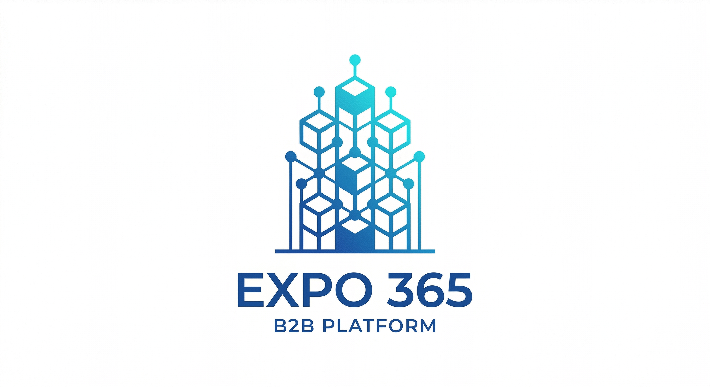

# EXPO 365 - Глобальная B2B экосистема для HoReCa индустрии



**EXPO 365** — это комплексная B2B платформа для индустрии HoReCa (Hotels, Restaurants, Cafes), объединяющая маркетплейс, HR-технологии, тендерную систему и аналитику в единую экосистему.

## 🚀 Быстрый старт

### Предварительные требования
- Node.js 18+ 
- npm, yarn, pnpm или bun
- Git

### Установка и запуск

```bash
# Клонирование репозитория
git clone https://github.com/anborisov69-ctrl/expo365new.git
cd expo-365

# Установка зависимостей
npm install

# Запуск в режиме разработки
npm run dev
```

Откройте [http://localhost:3000](http://localhost:3000) в браузере.

### Сборка для продакшена

```bash
npm run build
npm start
```

## 🏗️ Архитектура проекта

### Технологический стек
- **Frontend**: Next.js 16 (App Router, Server Components), React 19, TypeScript
- **Styling**: Tailwind CSS 4, shadcn/ui компоненты
- **Backend**: Supabase (PostgreSQL, Auth, Storage, Realtime)
- **Database**: PostgreSQL с Row Level Security (RLS)
- **Deployment**: Vercel (оптимизировано для Next.js)

### Структура проекта
```
expo-365/
├── src/
│   ├── app/                    # Next.js App Router страницы
│   │   ├── horeca/            # Основной B2B портал
│   │   │   ├── marketplace/   # Маркетплейс поставщиков
│   │   │   ├── hr-hub/        # HR-технологии (вакансии, резюме)
│   │   │   ├── buyer/         # Кабинет покупателя
│   │   │   ├── admin/         # Административная панель
│   │   │   └── finance/       # Финансовые инструменты
│   │   └── api/               # API маршруты
│   ├── components/            # React компоненты
│   ├── modules/               # Бизнес-модули
│   ├── services/              # Бизнес-логика
│   ├── hooks/                 # Кастомные React хуки
│   ├── lib/                   # Утилиты и конфигурации
│   └── types/                 # TypeScript типы
├── docs/                      # Документация
├── public/                    # Статические файлы
└── supabase/                  # Supabase миграции и конфигурации
```

## 🎨 Дизайн-система

### Цветовая палитра
| Токен | HEX | Назначение |
|-------|-----|------------|
| `brand-blue` | `#0B2B5E` | Основной цвет — стабильность, навигация, доверие |
| `brand-orange` | `#F26522` | Акцентный цвет — CTA, интерактивные элементы, алерты |
| `brand-green` | `#27AE60` | Успех — подтверждения, рост, завершенные статусы |

### Типографика
- **Основной шрифт**: Geist (оптимизирован Vercel)
- **Размеры**: Используется система масштабирования Tailwind

## 📊 Бизнес-модули

### 1. Маркетплейс
- Каталог поставщиков HoReCa оборудования и расходников
- Умный поиск с фильтрацией по брендам, категориям, регионам
- Система рекомендаций на основе AI
- Интеграция с финансовыми инструментами

### 2. HR-Tech (Кадровый хаб)
- Публикация вакансий для HoReCa заведений
- Размещение резюме специалистов
- Система откликов и коммуникации
- Аналитика рынка труда

### 3. Тендерная система
- Создание и управление тендерами
- Многоуровневая система доступа (публичные/приватные)
- Финансирование тендеров через банки-партнеры
- Автоматическое закрытие и уведомления

### 4. Аналитика и BI
- Панели управления для покупателей и поставщиков
- Прогнозные AI-сигналы по лояльности и оттоку
- Аналитика эффективности сделок
- Отслеживание KPI в реальном времени

## 🔐 Безопасность и авторизация

### Мультитенантная архитектура
- Row Level Security (RLS) для изоляции данных клиентов
- UUID-based идентификаторы для всех сущностей
- Ролевая модель доступа (покупатель, поставщик, администратор, банк)

### Аутентификация
- Supabase Auth с JWT токенами
- Сессии через cookies (SSR-совместимо)
- Поддержка социальных провайдеров

## 🌐 Интернационализация
- Поддержка русского и английского языков
- Архитектура с готовностью к добавлению новых языков
- Локализованные форматы дат, валют, чисел

## 🛠️ Разработка

### Доступные скрипты
```bash
npm run dev      # Запуск в режиме разработки
npm run build    # Сборка для продакшена
npm run start    # Запуск собранного приложения
npm run lint     # Проверка кода с ESLint
```

### Конфигурация окружения
Создайте файл `.env.local` в корне проекта:
```env
NEXT_PUBLIC_SUPABASE_URL=your_supabase_url
NEXT_PUBLIC_SUPABASE_ANON_KEY=your_supabase_anon_key
```

### Компоненты shadcn/ui
Проект использует следующие компоненты из shadcn/ui:
- Button, Card, Badge
- Sidebar, Tabs, Table
- Toast уведомления

## 📈 Производительность
- Оптимизация для низкой задержки (региональные серверы)
- Server Components для уменьшения размера бандла
- Кэширование на уровне ISR (Incremental Static Regeneration)
- Оптимизированные изображения через Next.js Image

## 🤝 Вклад в проект

### Процесс разработки
1. Форкните репозиторий
2. Создайте ветку для вашей функции (`git checkout -b feature/amazing-feature`)
3. Зафиксируйте изменения (`git commit -m 'Add amazing feature'`)
4. Отправьте в ветку (`git push origin feature/amazing-feature`)
5. Откройте Pull Request

### Стандарты кода
- Используйте TypeScript для типизации
- Следуйте правилам из `MANIFESTO.md`
- Используйте Prettier для форматирования
- Пишите комментарии на английском языке

## 📚 Документация

### Основные документы
- [MANIFESTO.md](docs/MANIFESTO.md) — основной манифест дизайна и разработки
- [TERMINOLOGY.md](docs/TERMINOLOGY.md) — глоссарий терминов
- [TECH-STACK.md](docs/tech-stack.md) — детали технологического стека
- [DEPLOYMENT.md](docs/DEPLOYMENT.md) — руководство по деплою

## 📄 Лицензия
Этот проект лицензирован под MIT License — смотрите файл [LICENSE](LICENSE) для деталей.

## 📞 Контакты и поддержка
- **Репозиторий**: [https://github.com/anborisov69-ctrl/expo365new](https://github.com/anborisov69-ctrl/expo365new)
- **Вопросы и предложения**: Открывайте Issues в репозитории

---

**EXPO 365** — революция в B2B взаимодействии для индустрии HoReCa. Объединяем поставщиков, покупателей и финансовые институты в единой цифровой экосистеме.
